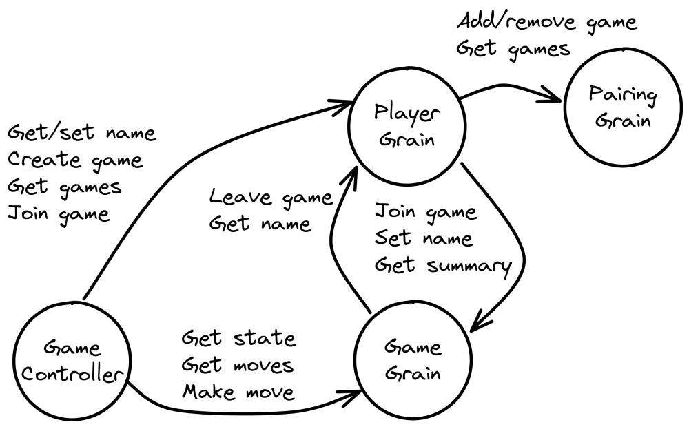

---
languages:
- csharp
products:
- dotnet
- dotnet-orleans
page_type: sample
name: "Orleans TicTacToe web-based game"
urlFragment: "orleans-tictactoe-web-based-game"
description: "An Orleans sample TicTacToe web-based game."
---

# Orleans TicTacToe web-based game

This sample demonstrates a Web-based [Tic-tac-toe](https://en.wikipedia.org/wiki/Tic-tac-toe) game.

The game is implemented as a single project, `TicTacToe.csproj`, which uses the [.NET Generic Host](https://docs.microsoft.com/dotnet/core/extensions/generic-host) to host an ASP.NET Core MVC application alongside Orleans.

The client-side of the game is a JavaScript application that polls the MVC application for updates. MVC controllers forward request to grains. The application has 3 types of grains:

* `PlayerGrain` represents a player, allowing the caller to join and leave games, update properties, and retrieve an overview of the past and present games.
* `GameGrain` represents an individual game session and the accompanying game logic. `GameGrain` allows clients to make moves and see the current game board state.
* `PairingGrain` which holds a list of the currently available games which other players can join.

The call flow is as follows:



## Sample prerequisites

This sample is written in C# and targets .NET 7.0. It requires the [.NET 7.0 SDK](https://dotnet.microsoft.com/download/dotnet/7.0) or later.

## Building the sample

To download and run the sample, follow these steps:

1. Download and unzip the sample.
2. In Visual Studio (2022 or later):
    1. On the menu bar, choose **File** > **Open** > **Project/Solution**.
    2. Navigate to the folder that holds the unzipped sample code, and open the C# project (.csproj) file.
    3. Choose the <kbd>F5</kbd> key to run with debugging, or <kbd>Ctrl</kbd>+<kbd>F5</kbd> keys to run the project without debugging.
3. From the command line:
   1. Navigate to the folder that holds the unzipped sample code.
   2. At the command line, type [`dotnet run`](https://docs.microsoft.com/dotnet/core/tools/dotnet-run).

Open a terminal window and execute the following at the command prompt:

```bash
dotnet run
```

The game server will start and you can open a browser to `http://localhost:5000/` to interact with the game.

If you wish, you can start more instances of the host to see them form a cluster. If you do so, add the `InstanceId` option on the command line to differentiate them. A production application would use something other than the "localhost clustering" which this application uses (see _Program.cs_ for where clustering is configured via `UseLocalhostClustering`) and therefore this `InstanceId` option would not be necessary.

```bash
dotnet run -- --InstanceId 1
```

Since the game uses cookies to identify players, you will need a separate browser session to be able to play against yourself and experience the game.


